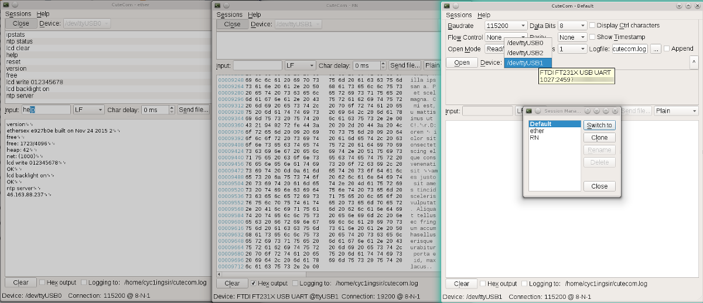

## Welcome to _CuteCom_

CuteCom is a graphical serial terminal, like minicom (or Hyperterminal on Windows, but I don't want to compare CuteCom to it, since Hyperterminal is really one of the worst applications I know).  
Currently it runs on Linux, FreeBSD and Mac OS X.  
It is aimed mainly at hardware developers or other people who need a terminal to talk to their devices. It is free software and distributed under the GNU General Public License Version 2. It is written using the [Qt library](http://www.qt.io/) by Trolltech. Follow this link to visit the [project page on GitHub](https://github.com/neundorf/CuteCom).  
CuteCom doesn't use the autotools (autoconf, automake, libtool, etc.) Instead "configure" displays some simple instruction refering to cmake. To uninstall CuteCom simply delete the file "cutecom" and the file "cutecom.desktop" and you're done. The config file is ~/.config/CuteCom/CuteCom.conf (was ~/.qt/cutecomrc in the Qt3-based versions).

### Satus:

With version 0.25.0, CuteCom was reimplemented taking advantage of Qt5 and the QtSerialport now available.
Quite a few features where added too. The GUI was modified to clear some space for displaying more of the output data.
This is more or less a developer preview and no package or tar ball is beeing provided at the moment.

### Features:

*   easy to use GUI
*   no cryptic keyboard shortcuts
*   lineoriented interface instead of character-oriented
*   Ctrl+C, Ctrl+Q and Ctrl+S control sequences work
*   input history
*   a cute GUI ;-)
*   control panel hides when not used 
*   xmodem, ymodem, zmodem support (requires the sz tools)
*   easy to differentiate between typed text and echoed text
*   select between read/write, read-only and write-only open mode
*   open the device without changing its settings (this is currently lost :-( )
*   hexadecimal input and output
*   configurable line end characters (LF, CR, LFCR)
*   configurable delay between characters
*   optionally show control caracters like line feed or tabs in output
*   optionally prefix each line in output with a timestamp
*   session support via -s <session name> specified at the command line
*   switching sessions via a session manager

### Requirements for Building:

*   CuteCom 0.25.0: Qt 5.1, CMake >= 2.8.11
*   CuteCom 0.22.0: Qt 4.1, CMake >= 2.4.3
*   CuteCom 0.14.2: Qt 3, qmake or CMake >= 2.4.3

## Download:

**_Previous version (uses Qt4):_** [cutecom-0.22.0.tar.gz,](http://cutecom.sourceforge.net/cutecom-0.22.0.tar.gz) , June 27th, 2009  
(yes, it's really only 22kb). Now also works on Mac OSX and supports more baud rates.  
Here is the complete [**_Changelog_**](Changelog).  

You can also browse the **[code only at GitHub](https://github.com/neundorf/CuteCom)**.  

**_Current state:_** stable  
**_TODO_ **:

*   font selection via the context menu of the output view
*   searching in the output view via context menu and Ctrl+F shortcut
*   get rid of Qt3Support
*   translations  

Pull requests are welcome ! :-)  

**_Previous versions:_**

*   [cutecom-0.21.0.tar.gz,](http://cutecom.sourceforge.net/cutecom-0.22.0.tar.gz) , May 11th, 2009
*   [cutecom-0.20.0.tar.gz,](http://cutecom.sourceforge.net/cutecom-0.21.0.tar.gz) , March 12th, 2008
*   [cutecom-0.14.2.tar.gz,](http://cutecom.sourceforge.net/cutecom-0.14.2.tar.gz) , January 26th, 2007 - _last version for Qt3_
*   [cutecom-0.14.1.tar.gz,](http://cutecom.sourceforge.net/cutecom-0.14.1.tar.gz) , November 22nd, 2006
*   [cutecom-0.14.0.tar.gz,](http://cutecom.sourceforge.net/cutecom-0.14.0.tar.gz) , July 16th, 2006
*   [cutecom-0.13.2.tar.gz,](http://cutecom.sourceforge.net/cutecom-0.13.2.tar.gz) , June 9th, 2005
*   [cutecom-0.13.1.tar.gz](http://cutecom.sourceforge.net/cutecom-0.13.1.tar.gz), February 2nd, 2005
*   [cutecom-0.13.0.tar.gz](http://cutecom.sourceforge.net/cutecom-0.13.0.tar.gz), January 29th, 2005
*   [cutecom-0.12.0.tar.gz](http://cutecom.sourceforge.net/cutecom-0.12.0.tar.gz), November 09th, 2004
*   [cutecom-0.11.0.tar.gz](http://cutecom.sourceforge.net/cutecom-0.11.0.tar.gz), October 13th, 2004
*   [cutecom-0.10.2.tar.gz](http://cutecom.sourceforge.net/cutecom-0.10.2.tar.gz), October 10th, 2004
*   [cutecom-0.10.1.tar.gz](http://cutecom.sourceforge.net/cutecom-0.10.1.tar.gz), August 11th, 2004
*   [cutecom-0.10.0.tar.gz](http://cutecom.sourceforge.net/cutecom-0.10.0.tar.gz)
*   [cutecom-0.0.8.tar.gz](http://cutecom.sourceforge.net/cutecom-0.0.8.tar.gz)
*   [cutecom-0.0.7.tar.gz](http://cutecom.sourceforge.net/cutecom-0.0.7.tar.gz)
*   [cutecom-0.0.6.tar.gz](http://cutecom.sourceforge.net/cutecom-0.0.6.tar.gz)
*   [cutecom-0.0.5.tar.gz](http://cutecom.sourceforge.net/cutecom-0.0.5.tar.gz)
*   [cutecom-0.0.4.tar.gz](http://cutecom.sourceforge.net/cutecom-0.0.4.tar.gz)

### Screenshot

Ok, here comes the inevitable screenshot:  

  

At the top you can see the widgets where you can adjust the serial communication settings. Beneath this part there is the output view, where you can see _everything_ the device sent back, also non-printable characters. And in the bottom part you can see the input area, with the input line to enter the commands, and the list featuring the history for the input line.

Currently CuteCom runs on Linux, FreeBSD and Mac OS X, porting to other UNIX-like platforms should be easy, and porting to Windows shouldn't be really hard. Everything platform specific should be in QCPPDialogImpl::setNewOptions(). Distributions are welcome :-)

CuteCom was heavily inspired by [Bray++ Terminal for Windows](https://sites.google.com/site/terminalbpp/).

### Author and contact:

Alexander Neundorf, <neundorf at kde dot org>

